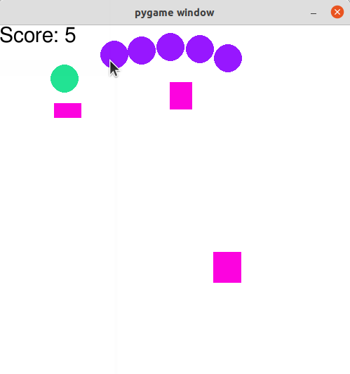

# Snake game

A simple Snake game written using Pygame. The snake is controlled by the mouse. A video demo can be found [here](https://www.dropbox.com/scl/fi/rrnvbeo5u1d9su0avmlhn/gameplay_vid.mp4?rlkey=ycb86jmroatbklz0jnd26s0ic&dl=0).

[](https://www.dropbox.com/scl/fi/rrnvbeo5u1d9su0avmlhn/gameplay_vid.mp4?rlkey=ycb86jmroatbklz0jnd26s0ic&dl=0)


To play, run the following in a terminal:

```
python main.py
```


### Dependency

numpy <br />
pygame <br />
